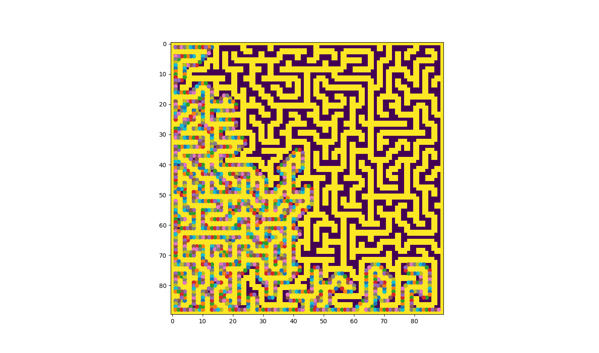

# mazes

# note:
  * all of these programs deal with SQUARE, mazes with all edges parallel to the standard basis vectors of R2
  * also, nearly all of the mazes here are simply connected (no "islands") which is not true of mazes in general

# programs
  * I can generate a maze in a lot of different ways, but depthFirstSearch.py gives the highest quality mazes

